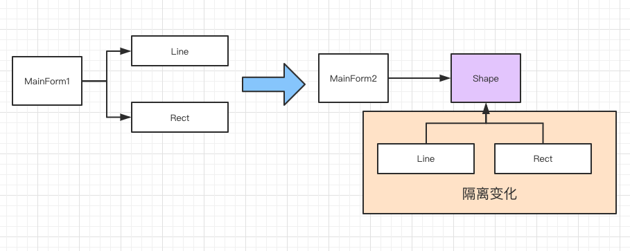

# C++设计模式

## ❓什么是设计模式

“每一个模式描述了一个在我们周围不断重复发送的问题，以及该问题的解决方案的核心。这样，你就能一次又一次地使用该方案而不必做重复劳动”。  ——Christopher Alexander

## ❓如何解决复杂性

- 分解
  - 人们面对复杂性有一个常见的做法：即分而治之，将大问题分解为多个小问题，将复杂问题分解为多个简单问题。
- 抽象
  - 更高层次来讲，人们处理复杂性有一个通用的技术，即抽象。由于不能掌握全部的复杂对象，我们选择忽视它的非本质细节，而去处理泛化和理想化了的对象模型。

## ❓什么是对象

- 从语言实现层面来看，对象封装了代码和数据。
- 从规格层面讲，对象是一系列可被使用的公共接口。
- 从概念层面讲，对象是某种拥有责任的抽象。

## ⭐️面向对象设计原则

> 千万不要讲设计模式当做算法来学习；
>
> 相比较于设计模式，面向对象的设计原则更加重要。
>
> 所有的设计模式都是依赖于这些设计原则推导出来的。  

 1. 依赖倒置原则（DIP）

- 高层模块(稳定)不应该依赖于低层模块(变化)，二者都应该依赖于抽象(稳定) 。

- 抽象(稳定)不应该依赖于实现细节(变化) ，实现细节应该依赖于抽象(稳定)。

  

  > 依赖倒置原则是非常依赖`Shape`抽象类的提出的。
  >
  > 依赖倒置原则是一个十分重要的原则，基本上贯穿所有的设计模式。

 2. 开放封闭原则（OCP）

- 对扩展开放，对更改封闭。

- 类模块应该是可扩展的，但是不可修改。

  > 用扩展的方式来应对需求的变化。

 3. 单一职责原则（SRP）

- 一个类应该仅有一个引起它变化的原因。
- 变化的方向隐含着类的责任。

 4. Liskov 替换原则（LSP）

- 子类必须能够替换它们的基类(IS-A)。
- 继承表达类型抽象。

 5. 接口隔离原则（ISP）

- 不应该强迫客户程序依赖它们不用的方法。
- 接口应该小而完备。

 6. 优先使用对象组合，而不是类继承

- 类继承通常为“白箱复用”，对象组合通常为“黑箱复用” 。

- 继承在某种程度上破坏了封装性，子类父类耦合度高。

- 而对象组合则只要求被组合的对象具有良好定义的接口，耦合度低。

  > ⚠️切记误用继承

 7. 封装变化点

- 使用封装来创建对象之间的分界层，让设计者可以在分界层的一侧进行修改，而不会对另一侧产生不良的影响，从而实现层次间的松耦合。

 8. 针对接口编程，而不是针对实现编程

- 不将变量类型声明为某个特定的具体类，而是声明为某个接口。

- 客户程序无需获知对象的具体类型，只需要知道对象所具有的接口。

- 减少系统中各部分的依赖关系，从而实现“高内聚、松耦合”的类型设计方案。

  > 产业强盛的标志：
  >
  > ⭐️**接口标准化！**

## 

## ⭐️从封装变化角度对模式分类
### 组件协作：
+ [Template Method](https://github.com/bearkchan/Cpp-Design-Patterns/tree/master/Template%20Method)
+ [Template-Pattern(Head-First版)](https://github.com/bearkchan/Cpp-Design-Patterns/tree/master/Template-Pattern)
+ [Observer/Event](https://github.com/bearkchan/Cpp-Design-Patterns/tree/master/Observer)
+ [Observer(Head-First版)](https://github.com/bearkchan/Cpp-Design-Patterns/tree/master/Observer-Pattern)
+ [Strategy](https://github.com/bearkchan/Cpp-Design-Patterns/tree/master/Strategy)
+ [Strategy(Head-First版)](https://github.com/bearkchan/Cpp-Design-Patterns/tree/master/Strategy-Pattern)
### 单一职责：
+ [Decorator](https://github.com/bearkchan/Cpp-Design-Patterns/tree/master/Decorator)
+ [Decorator(Head-First版)](https://github.com/bearkchan/Cpp-Design-Patterns/tree/master/Decorator-Pattern)
+ [Bridge](https://github.com/bearkchan/Cpp-Design-Patterns/tree/master/Bridge)
### 对象创建:
+ [Factory Method](https://github.com/bearkchan/Cpp-Design-Patterns/tree/master/Factory%20Method)
+ [Factory(Head-First版)](https://github.com/bearkchan/Cpp-Design-Patterns/tree/master/Factory-Pattern)
+ [Bridge](https://github.com/bearkchan/Cpp-Design-Patterns/tree/master/Bridge)
+ [Abstract Factory](https://github.com/bearkchan/Cpp-Design-Patterns/tree/master/Abstract%20Factory)
+ [Prototype](https://github.com/bearkchan/Cpp-Design-Patterns/tree/master/Prototype)
+ [Builder](https://github.com/bearkchan/Cpp-Design-Patterns/tree/master/Builder)
### 对象性能：
+ [Singleton](https://github.com/bearkchan/Cpp-Design-Patterns/tree/master/Singleton)
+ [Flyweight(享元模式)](https://github.com/bearkchan/Cpp-Design-Patterns/tree/master/Flyweight)
### 接口隔离:
+ [Façade(门面模式)](https://github.com/bearkchan/Cpp-Design-Patterns/tree/master/Facade)
+ [Proxy](https://github.com/bearkchan/Cpp-Design-Patterns/tree/master/Proxy)
+ [Mediator(中介者)](https://github.com/bearkchan/Cpp-Design-Patterns/tree/master/Mediator)
+ [Adapter](https://github.com/bearkchan/Cpp-Design-Patterns/tree/master/Adapter)
### 状态变化：
+ [Memento(备忘录)](https://github.com/bearkchan/Cpp-Design-Patterns/tree/master/Memento)
+ [State](https://github.com/bearkchan/Cpp-Design-Patterns/tree/master/State)
### 数据结构：
+ [Composite(组合模式)](https://github.com/bearkchan/Cpp-Design-Patterns/tree/master/Composite)
+ [Iterator](https://github.com/bearkchan/Cpp-Design-Patterns/tree/master/Iterator)
+ [Chain of Resposibility(职责链)](https://github.com/bearkchan/Cpp-Design-Patterns/tree/master/Chain%20of%20Resposibility)
### 行为变化：
+ [Command](https://github.com/bearkchan/Cpp-Design-Patterns/tree/master/Command)
+ [Command(Head-First版)](https://github.com/bearkchan/Cpp-Design-Patterns/tree/master/Command-Pattern)
+ [Visitor](https://github.com/bearkchan/Cpp-Design-Patterns/tree/master/Visitor)
### 领域问题：
+ [Interpreter](https://github.com/bearkchan/Cpp-Design-Patterns/tree/master/Interpreter)

## 总结
### 现代较少用的模式
+ Builder
+ Mediator
+ Memento
+ Iterator
+ Chain of Resposibility
+ Command
+ Visitor
+ Interpreter
